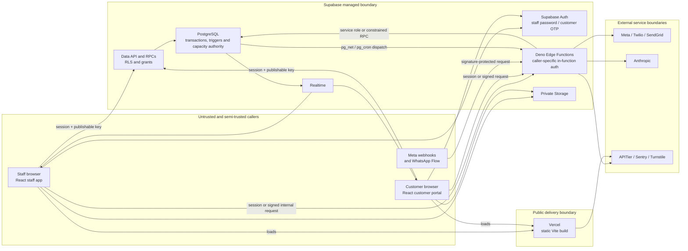

# Current architecture overview

**Status:** Active
**Authority:** Current component, trust-boundary and deployment map
**Baseline:** `main@8eb8800fb345aeeba4887b266a4ff95a85fb7802`
**Last verified:** 9 August 2026

This is a map of the system that exists, not a promise that every planned
capability is live. Where the distinction matters:

- **Confirmed** means the repository directly demonstrates the statement.
- **Prior observation (unverified here)** means a preceding planning audit
  reported the statement, but its target, query and execution record were not
  retained in the repository. See the [plan-versus-reality audit](../research/2026-08-09-issue-603-plan-reality-audit.md#unverified-prior-aggregate-snapshot).
- **Accepted target** means an architecture decision governs future work but
  the implementation is incomplete.
- **Inference** means the conclusion follows from several confirmed facts but
  is not itself an executable contract.

## System shape

Smarter Dog is a modular monolith: one React single-page application, one
Supabase project and a set of Deno Edge Functions around one PostgreSQL
database. The staff and customer interfaces share a deployment and domain
model, while database transactions and row-level security form the final data
boundary.

The arrows show principal data flows, not an assertion that every Edge
Function uses the same authentication mechanism. It does not: that distributed
authentication boundary is a current gap tracked by issue #605.

## Components and responsibilities

| Component | Current responsibility | Authority or limitation |
|---|---|---|
| React/Vite application | Staff dashboard at `/*` and customer portal at `/customer/*`; presentation, local preflight, optimistic UI and realtime reconciliation | It is not the final authority for capacity, identity, policy or permissions. The deterministic sample-data mode is not durable offline operation. |
| Supabase Auth | Staff email/password sessions and customer phone-OTP sessions | A valid session establishes identity, not business permission. Database grants, RLS and command checks still apply. |
| Data API and RPCs | RLS-filtered reads, direct legacy writes and security-definer/invoker commands | The command transaction is the boundary for atomic domain changes. Direct booking-row writers remain a migration constraint. |
| PostgreSQL | Durable domain state, RLS, constraints, triggers, RPCs, audit events and capacity enforcement | **Confirmed:** it is the final capacity and transaction authority. |
| `bookings` | One operational row per dog/service line, including grooming status | **Confirmed current:** live staff write paths still create, update and delete these rows. |
| `booking_visits` and related tables | One visit aggregate, lineage, policy/deposit/incident records, projections and typed visit commands | **Confirmed substrate:** legacy writes dual-write `legacy_compat` visits. Most visit mutation commands are deliberately dark, so this is not yet the sole live authority. |
| Edge Functions | WhatsApp ingress and Flow handling, notifications, AI assistance, calendar feeds, postcode lookup and other privileged integration work | CI deploys with gateway JWT verification disabled; each function must enforce its own caller contract. Coverage is not yet complete. |
| Realtime | Reconciles browser state after database changes and powers live inbox/dashboard updates | It is a change signal, not a command or delivery guarantee. |
| Storage | Private dog and WhatsApp media objects | Access depends on bucket policy, RLS or signed access; object URLs must not be treated as public by default. |
| `notification_log` | Current booking/recipient/trigger-oriented notification state and provider evidence | It has `pending`, `sent` and `failed` states plus partial idempotency. It is not the proposed visit-level intent and append-only attempt history. |

## Booking and visit authority

There are deliberately two architectural generations in the same database:

1. **Live legacy authority — confirmed.** Staff hooks still mutate `bookings`
   rows. The atomic `create_staff_booking_group` command protects grouped
   creation, but ordinary update/delete paths remain booking-row operations.
2. **Dark visit substrate — confirmed.** Fourteen migrations beginning with
   `20260726144000_booking_visit_foundation.sql` add visits, lineages, policy
   state, customer/staff projections, typed receipts and idempotent commands.
   Compatibility triggers attach legacy rows to `legacy_compat` visits.
3. **Policy activation — separate by accepted decision.** Moving an operation
   to visit authority must not activate `previous_day_1500_v1`. The
   `V1_ONLY_COMMANDS` test prevents a dark policy mutation from gaining a
   production caller accidentally. See the [booking-policy routing
   specification](../specifications/booking-policy.md) and
   [ADR 002](decisions/002-separate-visit-authority-from-policy-activation.md).

The split is transitional, not a recommendation to maintain two authorities
forever. **Inference:** every additional direct booking-row caller increases
the reconciliation and retirement surface, so cutover work must inventory and
sequence callers rather than switch the whole system at once.

## Capacity authority

Capacity currently has three execution copies:

- TypeScript in the browser for immediate feedback;
- Deno helpers for WhatsApp/Edge preflight; and
- PostgreSQL triggers and functions for final writes and concurrency.

The [capacity reference](../capacity-engine.md) defines current rules and
documents the mirrored constants. PostgreSQL rejects the final stale or
invalid write, including a browser/Edge preflight that was valid moments
earlier. Browser and Deno results are advisory until the transaction commits.
This established decision is recorded in [ADR 001](decisions/001-postgresql-capacity-authority.md).

## Persistence and data flow

The principal durable domains are:

- humans, dogs, trusted contacts and staff profiles;
- booking lines, groups, capacity blocks, closures and booking events;
- visit aggregates, line membership, lineages, policy versions, change
  requests, deposits, incidents, credits and audit records;
- WhatsApp conversations, messages, provider events, drafts and action audits;
- notification records and staff web-push subscriptions; and
- private media in Supabase Storage.

Browser reads and writes normally use the publishable key plus an Auth session.
PostgreSQL applies grants, RLS and command checks. Edge Functions may use a
caller session for user-scoped work or the service role for trusted integration
work; service-role use bypasses RLS and therefore expands the importance of the
function's own authentication and projection limits.

Legacy booking writes can synchronously update booking/visit state and enqueue
asynchronous work through triggers. The browser then reconciles through
Realtime. A realtime echo proves a database change, not that an external
provider accepted or delivered a message.

## Authentication and trust boundaries

- **Staff:** Supabase Auth identifies the user; `staff_profiles`, `is_staff()`
  and owner-specific checks determine staff/owner authority.
- **Customers:** Supabase Auth phone OTP identifies the account. A guarded
  linking command binds the verified identity to the matching human before RLS
  exposes customer-owned records.
- **Anonymous callers:** only explicitly granted low-PII projections and
  signed webhook/Flow routes should be reachable. Anonymous table access is
  not a substitute for a public projection.
- **Edge Functions:** the deployment workflow currently uses
  `--no-verify-jwt`. Functions rely on HMACs, provider signatures, internal
  secrets, session checks, role checks and origin policy in different
  combinations. There are 27 deployable entry points but 22 function sections
  in `supabase/config.toml`; five entry points are implicit. This is a
  confirmed inventory gap, not proof that those five are unauthenticated.
- **External providers:** requests and callbacks cross organisational
  boundaries. Provider acceptance, provider delivery and customer receipt are
  distinct facts and must be represented honestly.

## External services

The current code integrates with:

- Meta WhatsApp Cloud API and encrypted WhatsApp Flows;
- Twilio Verify for customer OTP and Twilio messaging where configured;
- SendGrid for email;
- Anthropic for the staff-reviewed WhatsApp assistant and summaries;
- APITier for postcode lookup;
- Cloudflare Turnstile for login abuse protection;
- Sentry for error reporting — integrated but **not currently enabled**, so no
  events are sent ([error-reporting.md](../error-reporting.md)); and
- browser Web Push providers through VAPID.

Secrets belong in Supabase/Vercel/GitHub secret stores or trusted local
processes. A `VITE_` variable is browser-visible and must never contain a
service-role or provider secret.

## Asynchronous work and delivery semantics

PostgreSQL triggers and scheduled jobs use `pg_net`/`pg_cron` to invoke Edge
Functions for notifications, reminders, waitlist work, staff push and WhatsApp
processing. Current notification functions claim partial idempotency by
inserting a `pending` row and later updating it to `sent` or `failed`; a reaper
marks stale pending rows failed.

That design cannot distinguish a conclusive pre-send failure from a worker
crash or timeout after a provider may have accepted the request. The accepted
target separates:

- the committed appointment operation;
- one durable visit-level notification intent; and
- append-only provider attempts, including `delivery_unknown`.

An ambiguous post-send attempt must not be retried blindly. The target contract
is in the [notification-delivery specification](../specifications/notification-delivery.md)
and [ADR 003](decisions/003-separate-operation-success-from-notification-delivery.md).

## Deployment and compatibility

| Layer | Current deployment path | Compatibility consequence |
|---|---|---|
| Frontend | Vercel deploys the Vite build after changes reach `main` | It can deploy before a manually applied schema unless the release gate is respected. |
| Edge Functions | GitHub Actions deploys changed functions on pushes to `main`; `_shared` changes redeploy all functions | Gateway JWT configuration is overridden by the workflow's blanket `--no-verify-jwt`. |
| PostgreSQL | Production migrations are applied manually | The exact target and exact migration must be verified before applying; no merge deploy applies schema automatically. |
| External prerequisites | Meta templates and provider configuration are managed outside Git | Code deployment does not prove that an approved template, sender or secret is usable. |

The repository has per-change `migrations-applied` and scheduled drift checks,
but no generic runtime schema/application capability contract. The accepted
programme keeps migration-bearing work serial and proposes a small named
capability projection so incompatible features fail closed. See
[ADR 004](decisions/004-serial-schema-convergence-and-runtime-capabilities.md)
and [ADR 006](decisions/006-manual-target-verified-database-rollout.md).

## Tests and assurance

- **Vitest logic tests:** pure domain engines, decoders, security/static
  migration guards and utilities.
- **Vitest component tests:** hooks and React behaviour in jsdom.
- **Deno tests and checks:** Edge Function modules and entry points.
- **pgTAP:** migrations, RLS, grants, database commands, policy/capacity rules
  and transaction behaviour on a disposable local Supabase stack.
- **Concurrency harnesses:** selected multi-session database races that a
  single pgTAP transaction cannot prove.
- **Playwright:** production-build browser journeys over deterministic sample
  data and a narrow intercepted policy transport.
- **CI:** lint, TypeScript, migration validation, Vitest and build run on pull
  requests; database tests run for database-related changes; the current E2E
  job deliberately skips pull requests and all configured projects use
  Chromium.

Tests prove the checked contract at a commit. They do not prove current
provider configuration, current production feature flags or a production
migration target; those need explicit release evidence.

## Constraints and invariants

- Preserve the React/Supabase/PostgreSQL architecture; no rewrite or
  microservice split is justified by the current programme.
- Do not activate `previous_day_1500_v1` incidentally.
- Whole-appointment operations are visit-level and atomic; per-dog grooming
  status may remain on booking lines.
- PostgreSQL remains the final capacity/concurrency authority.
- A database commit is not customer-message delivery proof.
- Ambiguous legacy visit grouping fails closed with typed
  `visit_review_required`; there is no raw-row mutation fallback.
- Migration-bearing changes and shared generated/RPC contracts land serially.
- Production database work remains manual, exact-target and exact-migration
  verified.
- Production evidence in general documentation stays aggregate-only unless
  separate authority permits identifiable data handling.

## Current gaps

| Area | Confirmed gap | Governing record |
|---|---|---|
| Staff reschedule | In-place booking-row moves do not create a customer reschedule notification | Issues #604/#609; [go/no-go research](../research/2026-08-09-reschedule-automation-go-no-go.md) |
| Edge authentication | No complete machine-readable caller/auth contract for all 27 functions | Issue #605 |
| Pull-request browsers | Playwright is skipped on PRs and WebKit is not configured | Issue #606 |
| Runtime compatibility | Booking-policy status exists; generic named schema/application capabilities do not | Issue #607; [ADR 004](decisions/004-serial-schema-convergence-and-runtime-capabilities.md) |
| Capacity parity | Browser, Deno and SQL remain separate implementations; final PostgreSQL authority exists but parity/race evidence is incomplete | Issue #608; [ADR 001](decisions/001-postgresql-capacity-authority.md) |
| Visit cutover | Strong visit substrate exists, but live staff write authority remains split | Issue #609; [ADR 002](decisions/002-separate-visit-authority-from-policy-activation.md) |
| Notifications | No visit-level intent plus append-only attempt history or `delivery_unknown` state | Issue #610; [notification specification](../specifications/notification-delivery.md) |
| Interface truth | Enabled-looking unavailable action, raw error text and demo/offline terminology remain inconsistent in code at the baseline | Issue #611 |
| Measurement | Useful signals exist without one governed metric catalogue | Issue #612 |

The dated issue-by-issue evidence and production arithmetic are recorded in
the [9 August audit](../research/2026-08-09-issue-603-plan-reality-audit.md).
